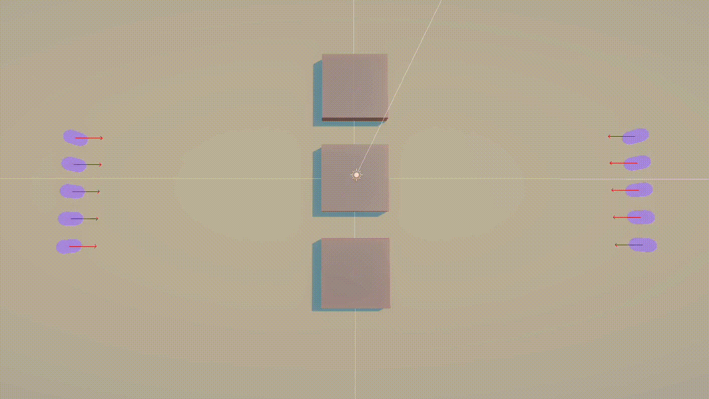

# GACollision
Collision avoidance algorithm for humanoid agents using genetic algorithms.

## Table of contents
- [GACollision](#gacollision)
  - [Table of contents](#table-of-contents)
  - [Introduction](#introduction)
  - [Technologies](#technologies)
  - [Setup](#setup)
  - [Features](#features)
  - [Ilustrations](#ilustrations)
  - [Design](#design)
  - [Sources](#sources)

## Introduction
Modern standard for solving collision avoidance in human based scenarios is mostly deterministic by using algorithms such as RVO or ORCA. The aim of this project was to explore a new way of solving collision avoidance for humanoid agents using genetic algorithms to search local space multiple steps ahead of the current simulation state. Algorithm is highly configurable, and some configurations performed even better than RVO in couple of scenarios, showing that there might be an alternative to already existing collision avoidance methods.

For more in-depth explanation as well as the implementation details, refer to my [thesis](./ReadmeLinks/thesis.pdf).

## Technologies
* Unity version 2022.3.7f1

## Setup
Switch to `BezierIndividual_only` branch and download this project, or download files under the `v1.0.0` tag.
You will need to download and install Unity (version 2022.3.7f1 or higher). Add downloaded files as a new project to your Unity projects in Unity Editor.

## Features
* Provide algorithm for humanoid agents capable of navigating by given path and avoiding collisions
* Unity based application running the algorithm in real-time
* Leveraging parallelism for enhanced performance
  * Using Unity Job system and Unity native collections 
* Running multiple predefined test scenarios and logging the results of each run
  * Results can be observed visually or by plotting
* Desing of the algorithm is general enough to easily add new genetic operators and test the difference
* Design of the application is general enough to allow simple modification to existing scenarios or creation of new ones

## Ilustrations
Example of 1 agent with various paths initialised for genetic algorithm: 

Opposite 
|                                     GA                                     |                                   RVO                                    |
| :------------------------------------------------------------------------: | :----------------------------------------------------------------------: |
|           |          |
|  |  |

## Design
Following simplified class diagram shows the most important classes present in the project.

To perform all relevant updates, application has defined sub-loop that is run inside Unity's `Update` method. See the following sequence diagram that shows a given sub-loop.

## Sources
Unity manuals: https://docs.unity3d.com/2022.3/Documentation/Manual/

[My thesis](./ReadmeLinks/thesis.pdf)

